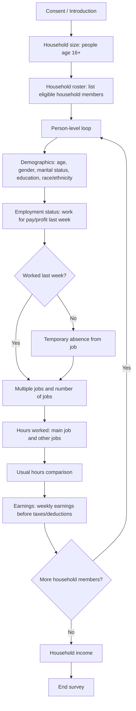

# Survey Flow Diagram

The diagram below summarizes the major questionnaire flow of the Current Employment Survey instrument.

## Design Notes

- The instrument begins with respondent consent and context setting.
- Household members age 16 or older are rostered before employment questions are asked.
- Employment questions are repeated at the person level.
- Follow-up questions distinguish working, temporary absence, multiple jobs, hours worked, usual hours, and earnings.
- Household income is collected after person-level employment items.
